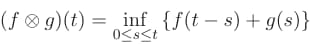
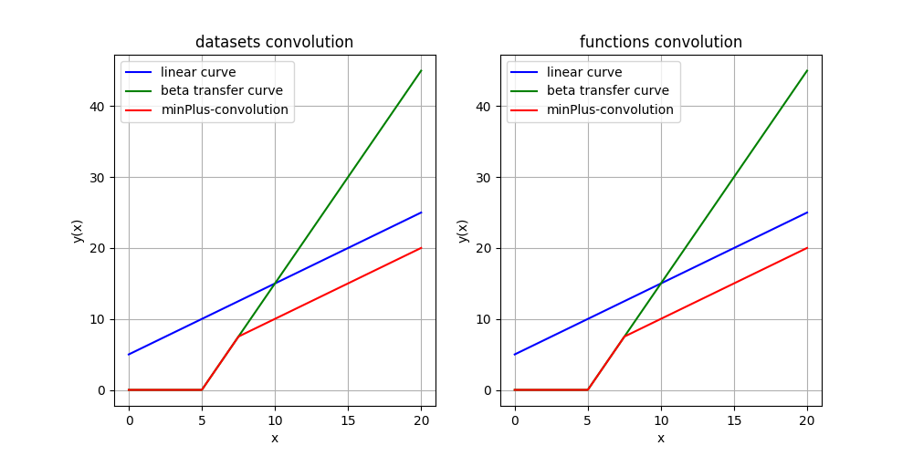
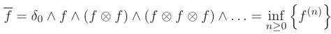
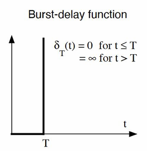
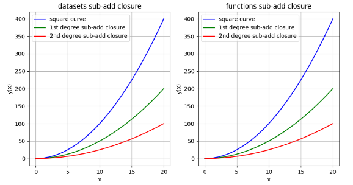
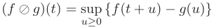
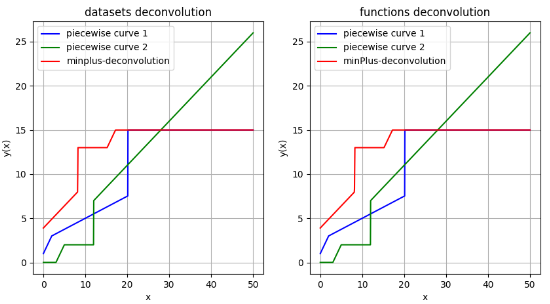

# MinPlus-Algebra

MinPlus-Algebra is a universal and powerful library for the ability to switch from nonlinear to linear systems and perform convolutional operations. The addition operation is replaced by the infimum operation. The multiplication operation is replaced by the addition operation. This approach is actively used in [Network Calculus](https://en.wikipedia.org/wiki/Network_calculus).

In MinPlus algebra, there are 3 basic operations for processing functions and combinations of functions: Convolution, Sub-Add Closure and Deconvolution. You can see examples of function handling below.

## Installation

The library is available in PyPI: [https://pypi.org/project/minplus-algebra/](https://pypi.org/project/minplus-algebra/)

If you want to install this library to your project, you only need to enter one command in the terminal:

```powershell
pip install minplus-algebra
```

If you need a specific version of the library, then add:

```powershell
pip install minplus-algebra==<version>
```

In order to delete the library, you need to:

```powershell
pip uninstall minplus-algebra 
```

## Available operations in the library

## In general

The library is implemented for the ability to perform convolutional operations for both datasets and functions of the form **f(x)**. The library has the ability to convert a dataset into a piecewise linear function, or vice versa, a piecewise linear function into a dataset. In the directory with **examples**, you can find an example of implementing convolutional operations for datasets and functions. You can't collapse a function with a dataset and a dataset with a function, first of all, convert one to the other using the library functions.

### Convolution

The convolution is an infimum over all sums of functions **f** and **g** depending on **t - s** and
**s**, respectively, where **s** is an argument running from **0 to t**. The convolution can be defined by the formula:



Next, you can see an example of the convolution of two curves: green and blue.



### Sub-additive closure

The sub-additive closure is introduced as the minimum among all convolutions of different order, that is, the search for the minimum among two convoluted functions, three, and so on. Formally, it can be described as:



where $\delta_T$ is:



The result of a sub-additive closure depending on **n** convolutions:



### Deconvolution:

The deconvolution is an supremum over all subs of functions **f** and **g** depending on **t + u** and
**u**, respectively, where **u** **≥ 0**. The deconvolution can be defined by the formula:



Next, you can see an example of the deconvolution of two curves: green and blue.



**An important note about the deconvolution:**

The deconvolution searches for supremums only when u >= 0. If you need to build an inverse convolution on the entire
set, but at the same time select only a part of it (on the graph), for example, on the set [5, +inf), then use the
following function from the matplotlib library to do this:

```python
X = np.linspace(-100, 100, 10000)
f = mpalgebra.MinPlusDeconvolution(defArea, func1 = your_curve1, func2 = your_curve2)

plt.xlim(5)
plt.plot(X, np.array([f(x) for x in range X]), color = 'red', label = 'deconvolution')
```

### Other operations:

The secondary operations available in the library are the **search for the L1 norm**, **minimizing it within the specified limits**, and **adding a constant to a function or dataset**.

## Unit tests

You can run the functional tests to check if you installation succeeded. We use the [PyCharm](https://www.jetbrains.com/pycharm/) plugin to run the Unit tests or enter the command in the console:

```powershell
python -m unittest tests\operators_test.py
```