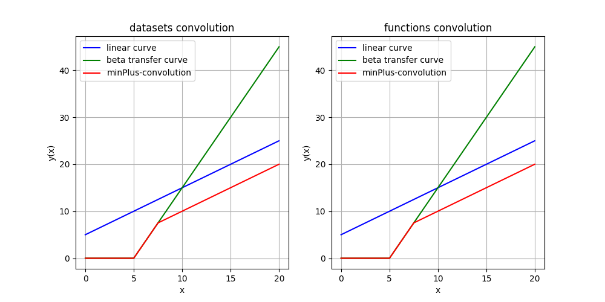
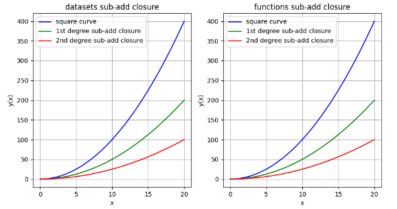
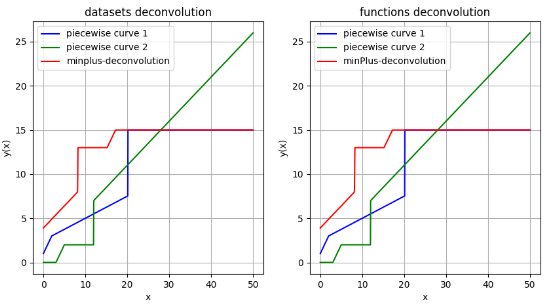

# Библиотека на языке программирования Python для операций MinPlus-Алгебры
#### Автор: Зайцев Александр Александрович

MinPlus-Algebra — универсальная и мощная библиотека для возможности перехода от нелинейных систем к линейным системам,
а также для выполнения сверточных операций. Операция сложения(+) заменяется операцией инфимума (inf).
Операция умножения(*) заменяется операцией сложения(+). Такой подход активно используется 
в [Network Calculus](https://en.wikipedia.org/wiki/Network_calculus). В MinPlus-алгебре есть 3 основные операции
для обработки функций и комбинаций функций: Convolution, Sub-Add Closure и Deconvolution.
Ниже вы можете увидеть примеры обработки функций.

## Установка

Библиотека доступна в PyPI: [https://pypi.org/project/minplus-algebra/](https://pypi.org/project/minplus-algebra/)

Для того, чтобы установить библиотеку в свой проект, необходимо ввести следующую команду в терминале:

```powershell
pip install minplus-algebra
```

Для того, чтобы установить библиотеку определенной версии, необходимо явно указать это следующим образом:

```powershell
pip install minplus-algebra==<version>
```

Для того, чтобы удалить библиотеку из проекта, необходимо ввести следующую команду в терминале:

```powershell
pip uninstall minplus-algebra 
```

## Возможности библиотеки

Библиотека реализована для возможности выполнения сверточных операций как для наборов данных, так и для
функций вида **f(x)**. В библиотеке есть функции, преобразующие набор данных в кусочно-линейную функцию,
или наоборот, кусочную функцию в набор данных. В каталоге с **examples** вы можете найти пример реализации
сверточных операций для наборов данных и функций. Вы не можете свернуть функцию с набором данных и
набор данных с функцией, прежде всего, преобразуйте одно в другое с помощью функций библиотеки.

### Свертка (прямая)

Свертка — это инфимум по всем суммам функций **f** и **g**, зависящим от **t - s** и
**s**, соответственно, где **s** — аргумент, пробегающий от **0 до t**. Свертку можно определить по формуле:


Далее вы можете увидеть пример свертки двух кривых: зеленой и синей.



### Суб-аддитивное замыкание

Субаддитивное замыкание вводится как минимум среди всех сверток разного порядка, 
то есть поиск минимума среди двух свернутых функций, трех и т. д. Формально это можно описать так:


где $\delta_T$ есть:


Результат субаддитивного замыкания, зависящего от **n** (1 и 2) сверток:



### Обратная свертка:

Обратная свертка является супремумом по всем подфункциям функций **f** и **g**, зависящим от **t + u** и
**u**, соответственно, где **u** **≥ 0**. Обратная свертка может быть определена формулой:


Далее вы можете увидеть пример деконволюции двух кривых: зеленой и синей.



**Важное замечание об обратной свертке:**

Обратная свертка ищет супремумы только при u >= 0. Если вам нужно построить обратную свертку на всем множестве,
но при этом выбрать только его часть (на графике), например, на множестве [5, +inf), 
то для этого используйте следующую функцию из библиотеки matplotlib:

```python
X = np.linspace(-100, 100, 10000)
f = mpalgebra.MinPlusDeconvolution(defArea, func1 = your_curve1, func2 = your_curve2)

plt.xlim(5)
plt.plot(X, np.array([f(x) for x in range X]), color = 'red', label = 'deconvolution')
```

### Другие операции доступные в библиотеке:

Вторичные операции, доступные в библиотеке, — это **поиск нормы L1**, 
**минимизация ее в указанных пределах** и **добавление константы к функции или набору данных**.

## Unit-тестирование

Чтобы запустить Unit-тесты, можно использовать, либо плагин [PyCharm](https://www.jetbrains.com/pycharm/), 
либо просто ввести команду в консоли:

```powershell
python -m unittest tests\operators_test.py
```

### Библиотека доступна по ссылке с примерами:
https://github.com/zaithevalex/minplus_algebra